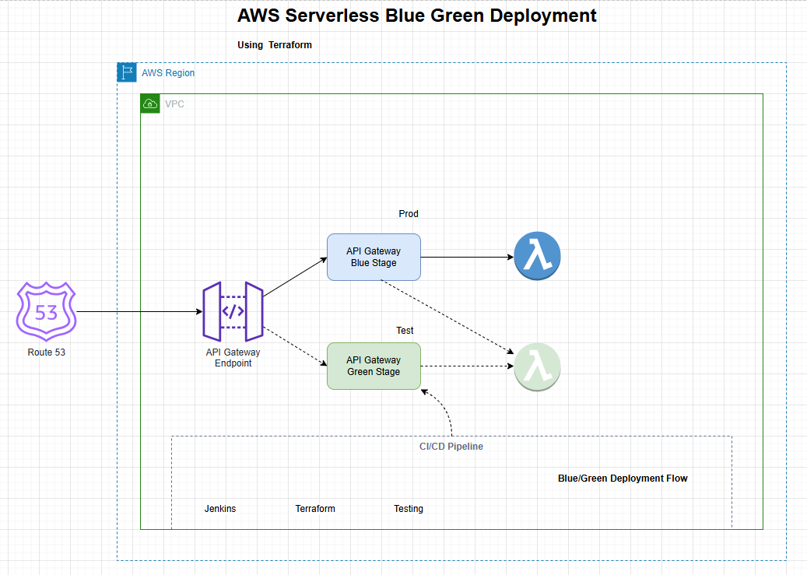

# AWS Serverless Blue/Green Deployment with Terraform

This POC demonstrates a Blue/Green deployment strategy for AWS Serverless -  Lambda functions using API Gateway with 2 stages, managed with Terraform and Bash scripts.

## Architecture



The architecture consists of:
- AWS Lambda function with two aliases (Blue/Green)
- API Gateway with two stages (Production and Test)
- Terraform for infrastructure management
- Bash script for deployment automation

## Components

1. Lambda Function:
   - Production alias (Blue) - Stable version
   - Test alias (Green) - New version for testing

2. API Gateway:
   - Production stage - Points to Blue Lambda alias
   - Test stage - Points to Green Lambda alias

3. Terraform Configuration:
   - Manages Lambda function, aliases, and API Gateway resources
   - Defines the basic infrastructure

4. Deployment Script:
   - Automates the deployment process
   - Manages version updates and promotions

## Deployment Workflow

1. Initial Setup:
   - Lambda function deployed with initial version
   - Both prod and test aliases point to the same version
   - API Gateway stages configured with respective endpoints

2. New Version Deployment:
   - New code packaged and uploaded
   - New Lambda version published
   - Test (Green) alias updated to new version
   - Test API Gateway stage points to Green
   - Production remains on stable version

3. Promotion to Production:
   - After testing, promote test version
   - Production (Blue) alias updated to new version
   - Both aliases now point to new version

## Usage

1. Clone the repository:
   ```
   git clone https://github.com/gopalsab/aws-serverless-blue-green-deploy-tf.git
   cd aws-serverless-blue-green-deploy-tf
   ```

2. Initialize Terraform:
   ```
   cd terraform
   terraform init
   terraform apply
   cd ..
   ```

3. Run the deployment script:
   ```
   ./deploy.sh
   ```

4. Follow the menu options to:
   - Deploy new version to test
   - Check current status
   - Promote test version to production

## Benefits

- Zero-downtime deployments
- Easy rollback mechanism
- Isolated testing environment
- Gradual rollout capability

## Future Improvements

- Add automated testing in the deployment pipeline
- Implement traffic shifting for gradual rollouts
- Enhance monitoring and alerting for deployment stages

# aws-serverless-blue-green-deploy-tf
# aws-serverless-blue-green-deploy-tf
